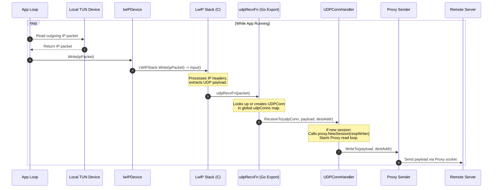
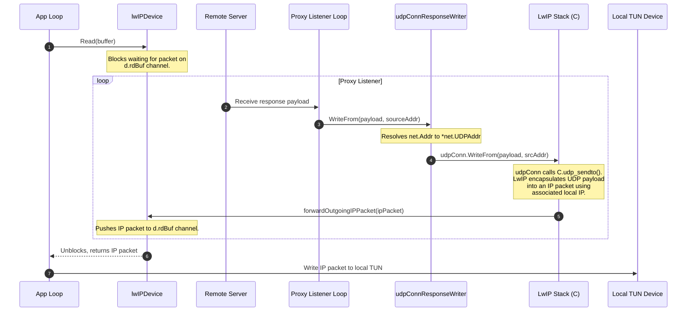

# LwIP Packet Traversal Sequence

This document tracks the traversal of packets through the `lwip2transport` LwIP network stack implementation, bridging the local host's TUN device and a remote proxy socket.

## Architecture & State Management

Before looking at the packet flows, it is important to understand how associations (connections) are managed between the TUN interface and the proxy.

* **Global Map (`udpConns`)**: The association state is managed by a global map of active connections, keyed by the source address.
* **`UDPConn`**: Represents a single association. It stores the necessary state, primarily the destination local IP, determining where return packets should be sent.
* **Association Lifecycle**: 
  - **Created**: When `udpRecvFn` receives a packet from a new source address.
  - **Closed**: Explicitly closed by the application (e.g., in `udpHandler.closeSession()`) or when the entire LwIP stack is shut down. The LwIP stack does *not* automatically time out or close these UDP associations. If a `UDPConn` is closed, the next packet from that source will simply create a new one.

---

## 1. Outbound Flow (Send Sequence): Local TUN Device to Proxy

This flow handles packets originating from the local device and heading out to the internet via the proxy.

### Step-by-Step Walkthrough

#### 1. Read from Local TUN
The VPN application runs a continuous loop reading outbound IP packets from the host OS TUN device. (On platforms like Apple, the OS may call a callback instead of the app actively reading).

#### 2. Write to `lwIPDevice`
The app writes the IP packet to the `lwIPDevice` (`lwIPDevice.Write`).

#### 3. Ingested by LwIP
`lwIPDevice.Write` pushes the raw packet into the LwIP stack (`LWIPStack.Write` which calls LwIP's `input()` function). 

#### 4. LwIP Processing & `udpRecvFn`
LwIP processes the IP headers. For UDP packets, it invokes the Go-exported callback `udpRecvFn` (`go-tun2socks.udp_callback_export`). 
* `udpRecvFn` handles the association logic. It queries the global `udpConns` map using the packet's source address. 
* If no association exists, it creates a new `UDPConn` (via `newUDPConn`), which registers the local and remote addresses.

#### 5. Hand-off to `UDPConnHandler`
`udpRecvFn` then calls the `ReceiveTo` method on the globally registered `UDPConnHandler`, passing the `UDPConn`, the payload, and the destination address.

#### 6. Session Creation & Proxying
`UDPConnHandler.ReceiveTo` checks if a proxy session exists for this `UDPConn`. 
* If new, it creates a `udpConnResponseWriter` and calls `proxy.NewSession()`, which typically spins up a background goroutine to listen for returning proxy traffic.
* It then delegates the payload to the proxy sender (`reqSender.WriteTo`), which writes it to the remote server via the proxy socket.

---

## 2. Inbound Flow (Receive Sequence): Proxy to Local TUN Device

This flow handles return traffic from the remote server, through the proxy, back to the local TUN device.

### Step-by-Step Walkthrough

#### 1. App Loop Waits for Packets
The application has a loop that continuously calls `lwIPDevice.Read()`. This call blocks, waiting for packets to arrive on the `d.rdBuf` channel.

#### 2. Proxy Receives Response
The background loop (spawned during the Outbound Flow) continuously reads from the proxy socket. It receives a UDP response payload from the remote server.

#### 3. Write to `udpConnResponseWriter`
The proxy listener passes the payload to `WriteFrom(payload, sourceAddr)` on the `udpConnResponseWriter` associated with this session.

#### 4. Hand-off to `UDPConn` & LwIP
The writer resolves the source address and calls `WriteFrom` on the underlying `UDPConn`.
* `UDPConn` contains the receiving packet logic. It calls the C function `C.udp_sendto()`, passing the payload along with the local and remote addresses stored in the association.
* The LwIP stack encapsulates the raw UDP payload into a full IP packet. The destination IP is determined by the local IP state held in the `UDPConn` association.

#### 5. LwIP Outputs IP Packet
Once LwIP constructs the IP packet, it calls its registered output callback: `forwardOutgoingIPPacket` (registered with `lwip.RegisterOutputFn`).

#### 6. Sent to `lwIPDevice` Read Channel
`forwardOutgoingIPPacket` writes the resulting IP packet into the `lwIPDevice`'s `d.rdBuf` channel. 

#### 7. Read by App & Written to TUN
The blocked `lwIPDevice.Read()` call (from Step 1) unblocks, copies the packet from `d.rdBuf`, and returns it to the application loop. The application then writes this complete IP packet back to the host OS local TUN interface.